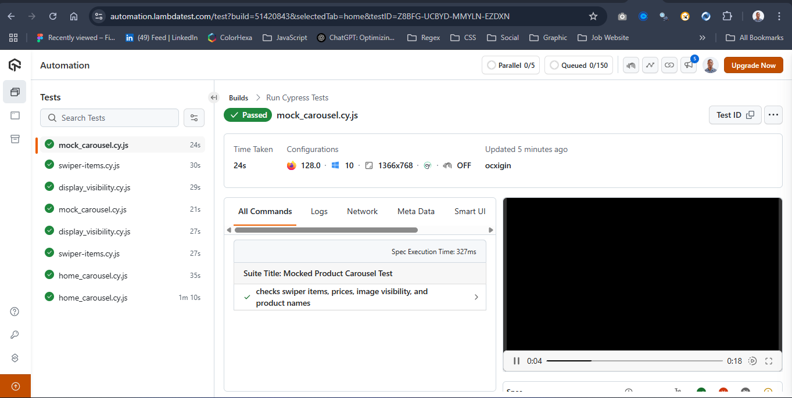

# How to Run Cypress Tests


# OUTLINE

- Introduction *(in 150 words)*
- What is Cypress run Command?
- Basic Syntax and Options of the Cypress Run Command
- Running Cypress Tests on Different Browsers *(show test execution on Chrome using LambdaTest)*
- Running Cypress in Headless Mode *(show test execution in headless mode on Chrome using LambdaTest)*
- Conclusion
- FAQs
- Citations

## Code example explanation

### Homepage Carousel Functionality

The test below performs the following functionality on the carousel items

- If all **3 carousels** (slides) are **visible**.
- If the **left/right control buttons** work.
- If the **3 pointer buttons** (usually small circles indicating slides) work.

```jsx
/// <reference types="cypress" />

describe('Homepage Carousel Functionality', () => {
  beforeEach(() => {
    cy.visit('https://ecommerce-playground.lambdatest.io/index.php?route=common/home');
  });

  it('checks that 3 carousel items are visible', () => {
    cy.get('#entry_217960 .carousel-item').should('have.length', 3);
    cy.get('#entry_217960 .carousel-item').each(($el, index) => {
      if ($el.hasClass('active')) {
        cy.wrap($el).should('be.visible');
      }
    });
  });

  it('should navigate using the left and right control buttons', () => {
    cy.get('#entry_217960 .carousel-control-next').click({force: true});
    cy.wait(1000);
    cy.get('#entry_217960 .carousel-item.active').should('be.visible');

    cy.get('#entry_217960 .carousel-control-prev').click({force: true});
    cy.wait(1000);
    cy.get('#entry_217960 .carousel-item.active').should('be.visible');
  });

  it('should navigate using the 3 indicator dots', () => {
    cy.get('#entry_217960 .carousel-indicators > li').should('have.length', 3);

    cy.get('#entry_217960 .carousel-indicators > li').each(($dot, index) => {
      cy.wrap($dot).click();
      cy.wait(1000);
      cy.get('#entry_217960 .carousel-item.active')
        .invoke('index')
        .should('eq', index);
    });
  });
});

```

- The `#entry_217960` is the main ID of the carousel on the page.
- Cypress waits (`cy.wait(1000)`) are used to allow animations to complete. You can replace them with `.should()` for better test practice if animation state is predictable.
- The `carousel-item.active` class determines the currently visible slide.

---

### LambdaTest Playground - Product Carousel

The test below performs the following functionality on the product carousel

- Logs how many `.swiper-slide` elements (carousel items) are visible.
- Checks that `.price-new` contains text with a `$` symbol.
- Checks that the product image has a valid `src` and is visible.
- Checks that the product name (`h4.title .text-ellipsis-2`) contains text.

```jsx
/// <reference types="cypress" />

describe('LambdaTest Playground - Product Carousel', () => {
    beforeEach(() => {
      cy.visit('https://ecommerce-playground.lambdatest.io/') // adjust URL if needed
    })
  
    it('performs product carousel checks', () => {
      // 1. Count swiper items and log
      cy.get('.swiper-slide')
        .then($items => {
          cy.log(`Number of swiper items: ${$items.length}`)
        })
  
      // 2. Check price contains text and $
      cy.get('.price-new')
        .should('exist')
        .each($price => {
          const text = $price.text()
          expect(text.trim()).to.not.be.empty
          expect(text).to.include('$')
        })
  
      // 3. Image src is valid and visible
      cy.get('.swiper-slide img')
        .should('be.visible')
        .and($img => {
          const src = $img.attr('src')
          expect(src, 'Image src should exist').to.match(/^https?:\/\//)
        })
  
      // 4. Product name exists
      cy.get('h4.title .text-ellipsis-2')
        .each($el => {
          const text = $el.text().trim()
          expect(text).to.not.be.empty
        })
    })
  })
  
```

---

### Using Local Fixture File

✅ Step 1 Create a fixture file in HTML and save in `cypress/fixtures/product-carousel.html`:

```html
<!DOCTYPE html>
<html lang="en">
<head>
    <meta charset="UTF-8">
    <meta name="viewport" content="width=device-width, initial-scale=1.0">
    <title>fixture and a mock HTML page for local Cypress testing</title>
</head>
<body>
    <div class="swiper-slide">
        
        <div class="caption">
          <h4 class="title"><a class="text-ellipsis-2">Sample Product Title</a></h4>
          <div class="price">
            <span class="price-new">$299.99</span>
          </div>
        </div>
      </div>
      <div class="swiper-slide">
        
        <div class="caption">
          <h4 class="title"><a class="text-ellipsis-2">Another Product</a></h4>
          <div class="price">
            <span class="price-new">$199.50</span>
          </div>
        </div>
      </div>      
</body>
</html>
```

✅ Step 2 Create a Cypress test file as `cypress/e2e/mock_carousel.cy.js` 

that loads the HTML fixture file.

```jsx
/// <reference types="cypress" />

describe('Mocked Product Carousel Test', () => {
    beforeEach(() => {
      cy.visit('cypress/fixtures/product-carousel.html') // Serve fixtures using a local server
    })
  
    it('checks swiper items, prices, image visibility, and product names', () => {
      // 1. Count swiper items
      cy.get('.swiper-slide')
        .should('have.length.at.least', 1)
        .then($items => {
          cy.log(`Number of swiper items: ${$items.length}`)
        })
  
      // 2. Prices should exist and contain $
      cy.get('.price-new')
        .each($price => {
          const text = $price.text()
          expect(text.trim()).to.not.be.empty
          expect(text).to.include('$')
        })
  
      // 3. Images are visible and have a valid URL
      cy.get('.swiper-slide img')
        .should('be.visible')
        .and('have.attr', 'src')
        .and('match', /^https?:\/\//)
  
      // 4. Product names should have text
      cy.get('h4.title .text-ellipsis-2')
        .each($el => {
          expect($el.text().trim()).to.not.be.empty
        })
    })
  })
  
```

✅ Step 3: **Serve the fixture locally**

To load HTML from the `fixtures` folder, you’ll need to serve it using a local server like this:

```bash
npx http-server cypress/fixtures -p 8080

```

This will install the `http-server` if you don’t have it install already on your project. So accept “y” and press enter. Your server should start instantly, otherwise run the `npx http-server cypress/fixtures -p 8080` again. 

---

### Swiper DOM Visibility and display:block Check

The cypress test below performs the following functionality

- Waits for the page to load
- Checks for any elements with either:
    - `style="display: none"` (or anything other than `block`)
    - `visibility: hidden`
- Logs the matching elements
- Confirms if any such elements exist

```jsx
/// <reference types="cypress" />

describe('Swiper DOM Visibility Check', () => {
    beforeEach(() => {
      cy.visit('https://ecommerce-playground.lambdatest.io/')
    })
  
    it('checks if any element has display:block or visibility:hidden', () => {
      // 1. Check for any element with display: block
      cy.get('*').then(($all) => {
        const blockElements = [...$all].filter(el => {
          const style = window.getComputedStyle(el)
          return style.display === 'block'
        })
  
        if (blockElements.length > 0) {
          cy.log(`Found ${blockElements.length} elements with display: block`)
        } else {
          cy.log('No elements with display: block found')
        }
      })
  
      // 2. Check for elements with visibility: hidden
      cy.get('*').then(($all) => {
        const hiddenElements = [...$all].filter(el => {
          const style = window.getComputedStyle(el)
          return style.visibility === 'hidden'
        })
  
        if (hiddenElements.length > 0) {
          cy.log(`Found ${hiddenElements.length} elements with visibility: hidden`)
          hiddenElements.forEach(el => {
            cy.log(`Hidden element: ${el.tagName}.${el.className}`)
          })
        } else {
          cy.log('No elements with visibility: hidden found')
        }
      })
    })
  })
  
```

---

## Conclusion

## `cypress open`

You can open Cypress from your **project root** using the commands, depending on the package manager. In this case, we are using `npm`. You can learn more about another package manager [here](https://docs.cypress.io/app/get-started/open-the-app#cypress-open)

```bash
npx cypress open
```

After a moment, the Cypress Launchpad will open.

## `lambdaTest Cypress set up`

Following are the steps to run your first Cypress test on the LambdaTest platform. [Read the Docs here](https://www.lambdatest.com/support/docs/getting-started-with-cypress-testing/#/prerequisites).

1. Install the LambdaTest-Cypress CLI using the below command.

```jsx
npm install -g lambdatest-cypress-cli
```

Use `init` command to generate the sample configuration files.

**Cypress v10**

```bash
lambdatest-cypress init --cv=10

```

Once you run the above command, below is the project structure for the `lambdatest-config.json` file.

**Cypress v10**

```jsx
{
  "lambdatest_auth": {
     "username": "<Your LambdaTest username>",
     "access_key": "<Your LambdaTest access key>"
  },
  // ... some code below 
}
```

1. Pass the below command to run the test.

```bash
lambdatest-cypress run

```

1. Visit LambdaTest Automation dashboard to view your test results. The CLI also has a link to view the Cypress test build.



This will run Cypress on LambdaTest Web Automation.